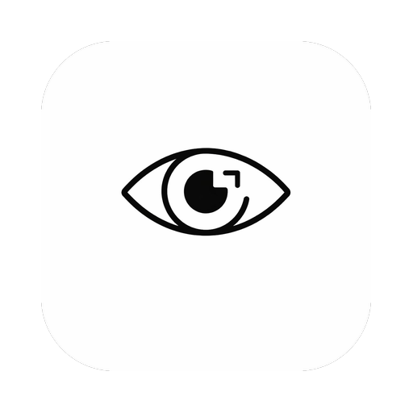

<div align="center">
  

  <h1>Mira</h1>

  <p><strong>A cross-platform screenshot and annotation tool</strong></p>

  <p>
    <em>Capture. Annotate. Share in seconds.</em>
  </p>

  <p>
    <a href="https://electronjs.org">
      
    </a>
    <a href="https://react.dev">
      
    </a>
    <a href="https://www.typescriptlang.org">
      
    </a>
    <a href="https://bun.sh">
      
    </a>
    <a href="https://codecov.io/gh/blas-works/mira">
      
    </a>
  </p>

  <p>
    <a href="#-features">Features</a> •
    <a href="#-installation">Installation</a> •
    <a href="#-development">Development</a>
  </p>
</div>

---

## ✨ Features

| 📸 **Capture**            | Multi-monitor screen capture with virtual bounds support |
| :------------------------ | :------------------------------------------------------- |
|                           | Region selection with resizable handles                  |
|                           | Dimension badge showing selection size in real-time      |
|                           | Magnifier for pixel-perfect selection                    |
| 🖊️ **Annotation**         | Pen tool for freehand drawing                            |
|                           | Arrow, rectangle, and text annotations                   |
|                           | Blur tool for sensitive information                      |
|                           | Eyedropper color picker with loupe                       |
|                           | 5 preset colors and custom color support                 |
|                           | 4 font sizes for text annotations                        |
| 🔄 **History**            | Undo/redo annotation history                             |
|                           | Keyboard shortcuts for every tool                        |
| 📋 **Actions**            | Copy to clipboard in one click                           |
|                           | Save to file system                                      |
|                           | Open in editor for further editing                       |
|                           | OCR text recognition with Tesseract.js                   |
| ⚙️ **Settings**           | Launch at startup                                        |
|                           | Capture sound toggle                                     |
|                           | Magnifier toggle                                         |
|                           | OCR language selection (Spanish/English)                 |
|                           | Customizable keyboard shortcuts                          |
| 🖥️ **System Integration** | System tray with context menu                            |
|                           | Platform-specific tray icons (macOS/Windows/Linux)       |
|                           | Global shortcut for instant capture                      |
| 🔄 **Automatic Updates**  | Smart updates with priority levels                       |
|                           | GitHub Releases auto-update channel                      |
| 💾 **Local Storage**      | electron-store for persistent settings                   |
|                           | Offline-first, privacy-focused                           |

## 🚀 Installation

### Homebrew (macOS/Linux)

Install Mira via [Homebrew](https://brew.sh):

**Option 1 — Add tap first (recommended):**

```bash
brew tap blas-works/apps
brew install --cask mira
```

**Option 2 — One-liner without tap:**

```bash
brew install --cask blas-works/apps/mira
```

To upgrade to the latest version:

```bash
brew upgrade --cask mira
```

### Manual Download

Download the latest version from [GitHub Releases](https://github.com/blas-works/mira/releases/latest).

| Platform    | Architecture  | Format             |
| ----------- | ------------- | ------------------ |
| **Windows** | x64           | `.exe` (NSIS)      |
| **Linux**   | x64           | `.AppImage` `.deb` |
| **macOS**   | Apple Silicon | `.dmg` `.zip`      |

### Development

#### Prerequisites

- **Node.js** >= 18.x
- **Bun** >= 1.0 (recommended) or npm

#### Quick Start

```bash
# Clone the repository
git clone https://github.com/blas-works/mira.git
cd mira

# Install dependencies
bun install

# Run in development mode
bun run dev
```

<details>
<summary><b>📖 Development Scripts</b></summary>

| Command                 | Description                         |
| ----------------------- | ----------------------------------- |
| `bun run dev`           | Development server with hot reload  |
| `bun run build`         | Production build (typecheck + vite) |
| `bun run build:unpack`  | Build without packaging             |
| `bun run build:win`     | Build for Windows (.exe)            |
| `bun run build:mac`     | Build for macOS (.dmg, .zip)        |
| `bun run build:linux`   | Build for Linux (.AppImage, .deb)   |
| `bun run test`          | Run tests in watch mode             |
| `bun run test:run`      | Run tests once                      |
| `bun run test:coverage` | Run tests with coverage report      |
| `bun run lint`          | Lint code with ESLint               |
| `bun run typecheck`     | Type check with TypeScript          |

</details>
